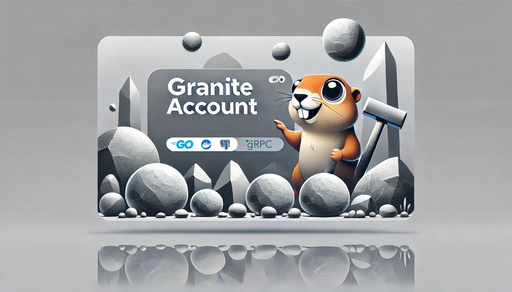

# Granite Account




Granite Account is a Go-based application designed to demonstrate production-grade patterns for an account management system in a fintech environment. The project focuses on building a robust, scalable architecture with a clear emphasis on reliability, traceability, and secure communication.

## Key Features

- **Traceable Requests:** Requests are tagged with unique request IDs, enabling end-to-end traceability across services for debugging and monitoring purposes.
- **Logger Middleware:** Integrated logging middleware captures every request and response, providing valuable insights for audit trails and system health checks.
- **ACID-Compliant Transactions:** Ensures that all database operations adhere to the ACID principles, guaranteeing consistency and reliability in transaction handling.
- **Client-Server Communication:** Employs JSON for simple and flexible communication between clients and the application.
- **Service-to-Service Communication:** Utilizes gRPC for high-performance, type-safe communication between microservices.

## Next Steps

- **Testing:** Add unit and integration tests to the application.
- **Rate Limiting:** Implementing rate limiting to control the flow of incoming requests, ensuring fair usage and preventing abuse.
- **Circuit Breaking:** Adding a circuit breaker pattern to enhance system resilience by gracefully handling potential service failures.

## Installation

To set up the project locally:

1. **Clone the repository:**
   ```bash
   git clone https://github.com/your-username/granite-account.git
   cd granite-account
   ```

2. **Build the project using the Docker Compose:**
   ```bash
   docker compose up --build
   ```

3. **Access the application:**
   The application should be running on `http://localhost:8080`.

## Usage

- **REST API:** Granite Account exposes a RESTful API for client communication, using JSON as the data format.
- **gRPC Services:** Microservices interact using gRPC, ensuring efficient and scalable service-to-service communication.
- **Request Logging:** Every request is logged along with its unique request ID, making it easy to track and troubleshoot issues.

## Contributing

Contributions are welcome! Please feel free to submit issues, fork the repository, and open pull requests.

## License

This project is licensed under the MIT License. See the [LICENSE](./LICENSE) file for more details.

